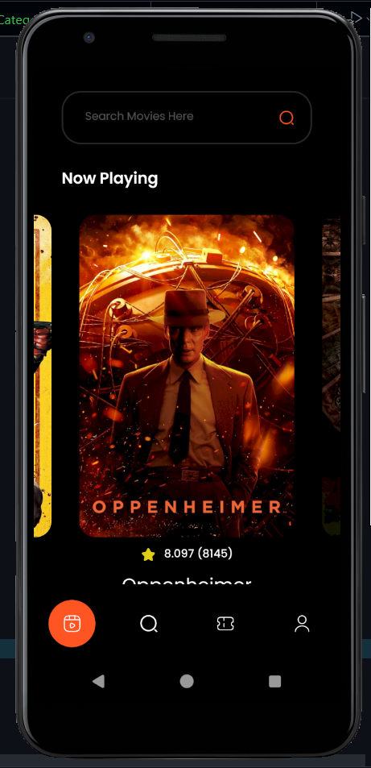
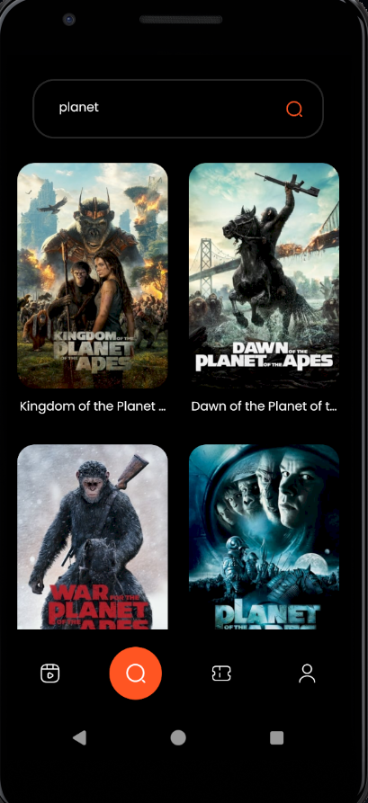
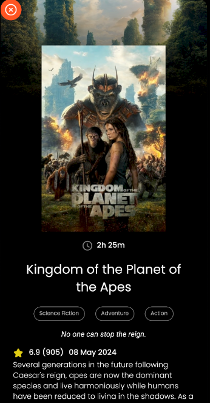
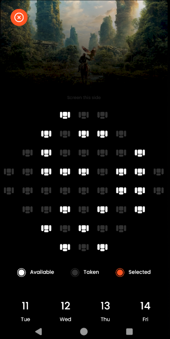

# Movie Ticket Booking App

Welcome to the Movie Ticket Booking App repository! This app is built using React Native and TheMovieDataBase API to provide a seamless movie browsing and ticket booking experience.

## Project Highlights

- **Explore Movies**: Browse Now Playing, Popular, and Upcoming Movies.
- **Search Functionality**: Find movies that interest you with a powerful search feature.
- **Detailed Info**: View comprehensive details like Movie Overview and Cast.
- **Ticket Booking**: Select your seats and book tickets seamlessly.
- **Local Storage**: Store your tickets on your device for easy access.

## Current Progress

- ✅ API Integration: Setting up seamless connections with TheMovieDataBase API.
- ✅ Themes: Implementing a visually appealing and consistent theme across the app.
- ✅ Navigation: Implemented Stack and Tab Navigation for an intuitive user experience.
- ✅ HomeScreen: Developed the HomeScreen as the central hub of the app.
- ✅ SearchScreen: Developed the SearchScreen as a key feature of the app for easy movie searches.
- ✅ MovieDetailsScreen: Developed the Movie Details Screen to display comprehensive information about each movie.
- ✅ SeatBookingScreen: Developed the Seat Booking Screen to allow users to select their preferred seats and book tickets directly through the app.

## Next Steps

- 🔄 Working on the Ticket Screen to provide users with their booked ticket information.

## Tech Stack

- **React Native**: For building the mobile application.
- **TheMovieDataBase API**: For fetching movie data.
- **React Navigation**: For implementing stack and tab navigation.
- **AsyncStorage**: For storing tickets locally on the device.

## Learnings

This project has been a great learning experience, allowing me to:

- Enhance my skills in **React Native** and mobile app development.
- Implement and manage **API integrations** effectively.
- Design and apply consistent **theming** across the app.
- Develop intuitive **navigation structures** using stack and tab navigation.
- Handle **local data storage** with AsyncStorage for offline access.

## Screenshot

## Usage

Once the app is running, you can:

- Browse the list of Now Playing, Popular, and Upcoming Movies.
- Use the search functionality to find specific movies.
- View detailed information about each movie, including overview and cast.
- Select seats and book tickets.
- Access your booked tickets locally stored on your device.

## Author

This app is created and managed by Vishal Pandey.
